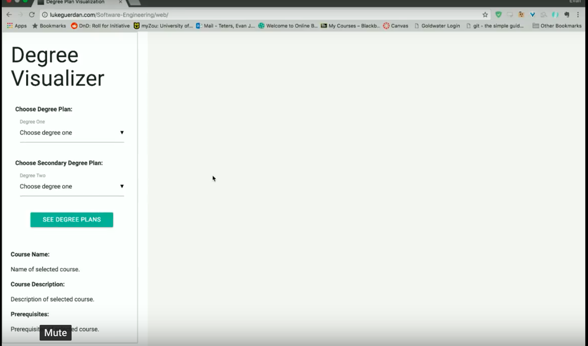
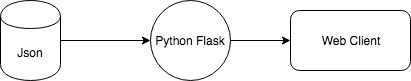
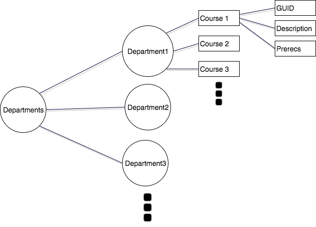
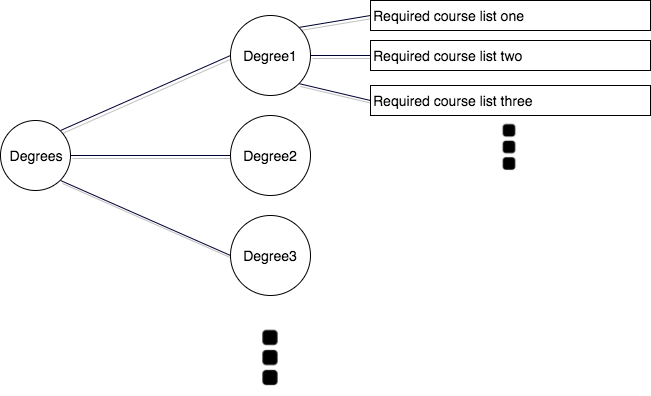

# Degree Visualizer
Brought to you by: Evan Teters, Chris Mitchell, Luke Guerdan, Abigail Sandusky, Lydia Snyder, Michael Thomas   

Website: http://lukeguerdan.com/Software-Engineering/web/
[](https://www.youtube.com/watch?v=bMaf7agOkCM)

- [Requirements](#requirements)
- [Application Architecture](#application-architecture)
- [Data Model](#data-model)
- [Backend Development](#backend-development)
- [Frontend Development](#frontend-development)


### Requirements

In one of our first meetings our team discussed what features we felt would be essential for our application. From this discussion, we determined our requirements.

Functional

* The application shall represent a course with a circular node and a text label in the visualization.
* The application shall represent a prerequesite relationship with a line in the visualization.
* The application shall provide a drop down of possible majors and minors for the user to choose from.
* The application shall make an API call to the Flask server requesting a list of courses for a chosen major or minor.
* The application shall visualize one chosen major.
* The application shall simultaneously visualize one chosen major and minor.
* The application shall simultaneously visualize two chosen majors.
* The application shall allow the selection of an individual course.
* The application shall show course name, prerequisites, and description upon selection.
* The server shall select courses for a requested major or minor based off of prerequisites and tags.
* The server shall deliver a list of courses for a major or minor in JSON upon request.
* The server shall use the course GUID and JSON prerequisites list to determine prerequisites.

Nonfunctional

* The application shall upon first release ( December 11, 2017 ) have three majors and two minors available in its data - CS Major, IT Major, Music Studies/Major, Math Minor, and Business Minor. 
* The application shall be available by December 11, 2017.
* The application shall dynamically update upon request by user.
* The application shall use JavaScript.
* The application shall use D3 to graph the courses.
* The application shall use Flask for the server.
* The application shall display the visualization in under one second.

### Application Architecture



### Data Model

Due to the complexity of degree programs and the number of variables to consider, we decided to store course and degree plan data in a JSON format. This allowed for easy changes of schema and modifying invalid fields; however, in the future we would likely port this structure to a NoSQL store such as MongoDB.

##### Courses:
Courses are organized by department and are stored as a collection, along with a GUID, description, title, and prerequisites. Prerequisites consist of an array of GUIDs for courses which are dependencies. In order to simplify the process, we decided not to include detailed prereqs such as "sophomore standing". In the event multiple courses can be a prereq, we took only the first (lowest) course entry.




```
{
    "ACCTCY": {
        "Department": "Accountancy (ACCTCY)",
        "Courses": [{
                "Title": "ACCTCY 2010:  Introduction to Accounting",
                "GUID": "ACCTCY2010",
                "Description": "Introduction to accounting for non-business majors.  Emphasis on introducing students to business operations, as well as preparing and using management information and financial accounting information for business decisions (does not count as either ACCTCY 2036 or ACCTCY 2037).",
                "Hours": "3",
                "Prerequisites": []
            },
            {
                "Title": "ACCTCY 2026:  Accounting I",
                "GUID": "ACCTCY2026",
                "Description": "An introduction to the field of accounting, this course covers the fundamentals of financial accounting. Business students at UMC must have advisor's approval.  Credit may not be earned for both ACCTCY 2026 and ACCTCY 2036.",
                "Hours": "3",
                "Prerequisites": []
            }]
        }
}
```
*****
##### Degrees:

Degrees were difficult to model due to their complex structure. To model required courses and in-major electives, we created a query structure in which courses are randomly selected from a list up to a predefined count value. We didn't have time to include out of major requirements since this is even more complicated and would require including many more classes in the course catalog.


```
{
   "CSMajor": {
      "requirements": [{
            "classes": ["CMP_SC1000", "CMP_SC1050", "CMP_SC2050", "CMP_SC2270", "CMP_SC3050", "CMP_SC3280", "CMP_SC3330", "CMP_SC3380", "CMP_SC4050", "CMP_SC4320", "CMP_SC4520", "CMP_SC4850", "CMP_SC4970", "CMP_SC4980"],
            "count": 14
         }, {
            "classes": ["CMP_SC4410", "CMP_SC4450"],
            "count": 1
         },
         {
            "classes": ["CMP_SC2830", "CMP_SC3530", "CMP_SC3940"],
            "count": 1
         }, {
            "classes": ["CMP_SC4001", "CMP_SC4060", "CMP_SC4080", "CMP_SC4085", "CMP_SC4270", "CMP_SC4280", "CMP_SC4380", "CMP_SC4430", "CMP_SC4440", "CMP_SC4460", "CMP_SC4610", "CMP_SC4620", "CMP_SC4650", "CMP_SC4670", "CMP_SC4720", "CMP_SC4730", "CMP_SC4740", "CMP_SC4750", "CMP_SC4770", "CMP_SC4830", "CMP_SC4990", "CMP_SC4995", "INFOTC4500"],
            "count": 5
         }, {
            "classes": ["MATH1500", "MATH1700", "MATH2300", "MATH2320", "STAT4710"],
            "count": 5
         }, {
            "classes": ["PHYSCS2750", "PHYSCS2760"],
            "count": 2
         }
      ]
   }
```
### Backend Development

The backend application was developed using the Python Flask framework and is deployed at [heroku]: https://evanescence.herokuapp.com/, and currently doesn't require authentication. The primary purpose of the Flask server is to provide a layer of abstraction over the course catalog and degree programs. The front end application requests either degrees or departments, and obtains a list of courses as a response.

The main work being done here is selecting courses in accordance with degree requirements and returning them to the front end for display.

##### Sample requests:

| Endpoint      | Params (required) | Params (optional)  | HTTP Methods
| ------------- |:------------------:| -----------------:|------------:|
| /get_degree   | deg1               | deg2              | `GET`
| /get_classes  | department         | num               | `GET`


### Frontend Development

Frontend Development was done using the jquery library and [d3](https://d3js.org/) for visualization. We combined aspects of different templates to get the look and behavior that we wanted. A challenge in the front end was knowing how the data was needed to be formatted, and we weren't sure until later into the project when we had more experience with d3. Because we didn't know this early, some extra work had to be done in javascript to make up for it.

The frontend is where the user is allowed to select one or two degree plans that we have decided on, and see a display of how those two plans line up in comparison to each other. Showing overlap between two plans was something we tried hard to implement.
